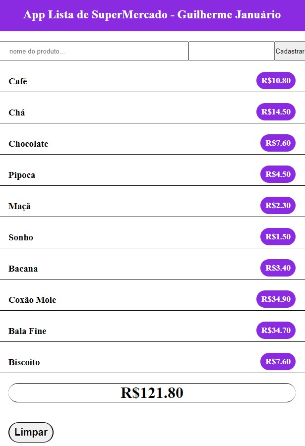

##Projeto sobre lista de supermercado

Projeto inicial para praticar e colocar em prática os estudos.

Objetivo dele é colocar o que compramos no mercado e somar no final antes de ir ao caixa, sebendo assim qual é o valor da compra antes de passar no caixa.

Teste teste

